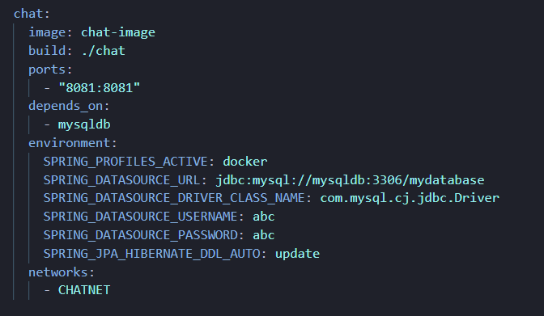

# Chad-Room

Willkommen bei Chad-Room, einer innovativen Chatanwendung für den Webbrowser, entwickelt als Projektabgabe für die Vorlesung "Cloud Native Software Engineering" an der Hochschule Kaiserslautern. Diese Vorlesung wurde von Gastdozenten des Unternehmens Novatec Consulting GmbH gehalten. Das Hauptziel des Projekts war es, eine 12-Faktor-konforme, cloud-native Anwendung zu erstellen, die effizient auf einer Cloud-Plattform betrieben werden kann. Chad-Room kann auf Google Cloud Run gehostet oder lokal auf Ihrem Rechner ausgeführt werden, wobei Google Cloud SQL oder eine lokale MySQL-Datenbank in einem Docker-Container zum Einsatz kommt, ergänzt durch einen Adminer-Container als Benutzeroberfläche für die lokale Datenbank.

## Installation

### Cloud-Setup

1. **Einrichten einer Cloud Run-Instanz**: Folgen Sie den Anweisungen von Google Cloud Run, um eine neue Instanz zu erstellen.
2. **Konfigurieren Sie Google Cloud SQL**: Richten Sie eine Cloud SQL-Instanz für die Datenbank ein.
3. **Umgebungsvariabeln in der Cloud-Umgebung setzen**: Setzen Sie Umgebungsvariabeln wie Datenbank-Uri, Spring Profile und weitere aus der application.properties und application-cloud.properties in dem Container Ihrer Cloud Run Instanz.
4. **POM-Profil in der Dockerfile setzen**: Entfernen Sie das '#' vor dem, für Cloud markierte, Befehl in dem Dockerfile der Anwendung.
   
    

### Lokales Setup

1. **Klonen des Repositories**: 
   ```bash
   git clone [Repository-URL]
   ```
2. **Spring Profil setzen**:
   ```bash
   $env:SPRING_PROFILES_ACTIVE="local/cloud"
   ```
4. **Starten der Anwendung**:
   *Stellen Sie sicher, dass Docker auf Ihrem System installiert ist und dass Sie den richtigen Befehl im Dockerfile entkommentiert haben.*
   
   Führen Sie die Anwendung mit Docker-Compose aus:
   ```bash
   docker-compose build --no-cache
   docker-compose up
   ```
   *Dies wird sowohl die Anwendung als auch die MySQL-Datenbank und den Adminer-Container starten.*

## Benutzung
Nach der Installation können Sie die Chad-Room-Anwendung in Ihrem Webbrowser öffnen. Die URL hängt von Ihrer Setup-Methode ab:

Für Cloud Run: [Cloud Run URL]

Für Lokales Setup: http://localhost:[Port] (*wird in der docker-compose.yml definiert*)



## Kontaktinformationen
Für weitere Informationen oder Unterstützung kontaktieren Sie bitte: 
Jens Müller unter [jemu1002@stud.hs-kl.de],

Joshua Reumann unter [jore1001@stud.hs-kl.de],

Artur Gibert unter [argi0001@stud.hs-kl.de].

## Status des Projekts
Dieses Projekt ist momentan inaktiv.

## weitere Befehle für Dev-Mode
$env:SPRING_PROFILES_ACTIVE="local/cloud"

mvn spring-boot:run   | anwendung lokal (db in docker starten)

mvn spring-boot:run -Pcloud   | anwendung lokal, db in cloud (zusätzlich in application-cloud.properties Zeile 15 entkommentieren und Pfad anpassen)
